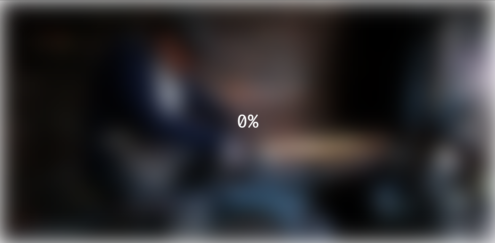

# Blurry Loading

此笔记是我写静态页面demo练手的记录，👇为该demo的原址：https://github.com/bradtraversy/50projects50days/tree/master/blurry-loading

发出来的目的是为了如果对你有一点点帮助就够了。

## 知识点

- ##### `background`
  
    这是一个简写属性，可以一次同时声明多个属性：
    
    - `background-clip`
      
        设置元素的背景图片或者背景颜色是否眼神到边框border，padding，内容盒子。
        
        [background-clip - CSS（层叠样式表） | MDN](https://developer.mozilla.org/zh-CN/docs/Web/CSS/background-clip)
        
    - `background-color`
      
        用于设置元素的背景色，只能是颜色值或者transparent中二者选一。
        
        当然颜色值的一些特殊形式要知道：
        
        - inherit 继承颜色
        - currentColor 当前颜色
        
    - `background-image`
      
        用于设置一个或者多个背景图
        
        [https://developer.mozilla.org/zh-CN/docs/Web/CSS/background-image](https://developer.mozilla.org/zh-CN/docs/Web/CSS/background-image)
        
        多个图像背景时，第一个设置的会在最上面，最接近用户。
        
        ```css
        background-image:
          linear-gradient(to bottom, rgba(255,255,0,0.5), rgba(0,0,255,0.5)),
          url('https://mdn.mozillademos.org/files/7693/catfront.png');
        ```
        
    - `background-origin`
      
        用于指定背景图片的原点位置的相对区域。
        
        - border-box  背景图像的摆放以border区域为参考
        - padding-box  以padding为参考
        - content-box   以content为参考
    - `background-position`
      
        用于设置背景图的初始位置。这个位置相对于background-origin定义的位置图层。
        
        关键字center，用来居中显示背景图片。本demo就用到这个属性。
        
        ```css
        background-position: center;
        ```
        
        [https://developer.mozilla.org/zh-CN/docs/Web/CSS/background-position](https://developer.mozilla.org/zh-CN/docs/Web/CSS/background-position)
        
    - `background-repeat`
      
        用来指定背景图像的重复方式
        
        [https://developer.mozilla.org/zh-CN/docs/Web/CSS/background-repeat](https://developer.mozilla.org/zh-CN/docs/Web/CSS/background-repeat)
        
    - `background-size`
      
        [https://developer.mozilla.org/zh-CN/docs/Web/CSS/background-size](https://developer.mozilla.org/zh-CN/docs/Web/CSS/background-size)
        
        - `cover`
         值尽可能大的缩放背景图像并保持图像的宽高比例（图像不会被压扁）。该背景图以它的全部宽或者高覆盖所在容器。当容器和背景图大小不同时，背景图的 左 / 右 或者 上 / 下 部分会被裁剪。
        - **`contain`**
          
            缩放背景图片以完全装入背景区，可能背景区部分空白。`contain` 尽可能的缩放背景并保持图像的宽高比例（图像不会被压缩）。
        
    - `background-attachment`
      
        决定背景图像的位置是在视口内固定，或者随着包含它的区块滚动。
    
- ##### **innerHTML、innerText、outerHTML、textContent、nodeValue、data**
    
    1. **innerHTML、outerHTML  只对元素节点有效**
        
        1. innerHTML：设置或获取当前元素下的HTML。
        
        ```jsx
        console.log(document.body.innerHTML);
        ```
        
        ```html
        <div class="bg"></div>
        <div class="percent">100%</div>
        <script src="script.js"></script>
        ```
        
        《现代js》中提到的`innerHTML+=` 的理解：
        
        ```jsx
        // elem.innerHTML+='HelloWorld' 等同于👇
        elem.innerHTML = elem.innerHTML + 'HelloWorld';
        ```
        
        上面的语句会完全重写，也就是旧的HTML加上'HelloWorld'。这段代码就是将旧的加上新的的之后再覆盖掉原来的。这就是重写了，所以如果HTML中需要加载资源的话则会重新加载资源。
        
    2. **innerText**
       
        得到的结果和textContent的结果是一样的，也是去除所有的标签。
        
    3. **outerHTML**：在innerHTML的基础上包括自己本身的元素。
       
        document.body.outerHTML不止包含其后代的HTML还包括他body本身。
        
    4. **textContent**
       
        提供了对**元素内的文本**的访问权限：仅文本，去掉所有标签。
        
        这个属性一般不拿来读，但是写入会用得比较多一些。
        
        ❗这里又涉及到innerHTML与textContent的区别：
        
        - 写入textContent，是以文本的形式写入的
        - 写入innerHTML，如果文本中有标签是要被浏览器正常渲染为相应的标签的。
    5. **nodeValue、 data**  只对文本节点有效

## 问题集

- 为什么以下代码使用calc( )函数计算不起作用？
  
    ```css
    width: calc(100vw + 60px); // 有效  中间+号两端有空格
    height: calc(100vh+60px);  // 无效
    ```
    
    在mdn的calc的参考中提到：
    
    • **`+` 和 `-` 运算符的两边必须要有空白字符。**比如，`calc(50% -8px)` 会被解析成为一个无效的表达式，解析结果是：一个百分比 后跟一个负数长度值。而加有空白字符的、有效的表达式 `calc(8px + -50%)` 会被解析成为：一个长度 后跟一个加号 再跟一个负百分比。
    
- background的简写代码解析
  
    ```css
    background: url('https://images.unsplash.com/photo-1576161787924-01bb08dad4a4?ixlib=rb-1.2.1&ixid=eyJhcHBfaWQiOjEyMDd9&auto=format&fit=crop&w=2104&q=80')
        no-repeat center center/cover; // 图片 repeat     position/cover
    ```
    
- setInterval的函数调用
  
    ```css
    let timeId = setInterval(blurring, 30);  // 而不是blurring()
    ```
    
    注意是没有括号的，因为setInterval期望得到一个对函数的引用，而不是blurring( )函数执行之后的结果。
    

## 项目重点/难点

背景模糊效果，第一次写。

首先拆开来分析，“遮罩层”：

一般情况下想到用`filter：blur(2px)`属性来处理。但是blur的值越来越大，四周会出现越来越严重的白边现象。`filter: blur(30px)`的效果👇



图一

好吧，发现了不得了的东西哈哈哈哈，这个白边的问题是由于body根的背景颜色是白色的。html和body之间可能存在着某种宇宙间隙(我猜的，其实我不知道)，到底为什么呢？找到一篇文章：[去掉模糊背景或图片的白边](https://www.clloz.com/programming/front-end/css/2019/05/23/blur-white-border/)

上面的文章中写到模糊效果会让底层的颜色露出来，那就是body的背景默认是白色的。我把body背景色变成黑色之后的效果：好像好多了。


图二

blur方法是使用高斯模糊处理图像，使之减少噪音和细节，达到平滑模糊效果。

关于处理模糊背景的白边问题，这个项目的原作者采用的是扩大背景所在元素的大小，以及把模糊部分移动到可视范围之外。

```css
position: absolute; // 使用绝对定位把白边对应的背景可视部分外移
top: -30px;
left: -30px;
width: calc(100vw + 60px );  // 扩大背景所在的元素大小
height: calc(100vh + 60px );
```


原项目作者的效果，可以看到还是有一点点白边的。好吧，不知道这里为什么显示不出来白边....

我的方法就是把背景图所在元素的父元素的背景色，设置为比你想要的模糊效果更深一些的颜色。就是图二中的效果。

## Demo最难点

背景从模糊到透明的同时显示百分比100%-0%的加载（不透明到透明）。


源码：

```jsx
let bg = document.querySelector('.bg');
let percent = document.querySelector('.percent');

let load = 0;

let timeId = setInterval(blurring, 30);

function blurring() {
    load++;

    if (load > 99) {
        clearInterval(timeId);
    }

    percent.innerText = `${load}%`;
    percent.style.opacity = scale(load, 0, 100, 1, 0);   // 1-0
    bg.style.filter = `blur(${scale(load, 0, 100, 30, 0)}px)`; // 30-0
}

// 此函数根据load（0-100的值）分别显示1-0和30-0（保留小数点后两位级别）的值。
const scale = (load, in_min, in_max, out_min, out_max) => {
    return ((load - in_min) * (out_max - out_min)) / (in_max - in_min) + out_min
}
```

可见

- `opacity` 的值1-0的过程是0.99、0.98、0.97的两位小数的精确度变化
- `blur()` 的值30-0的过程也是如此。

scale函数导致了这种精确化的变化，这个函数很巧妙。如果没有这个函数，其模糊效果变化是很快的，刚开始我自己写的时候是采用100自减的过程，没有这么精确，所以是很快的。如果这个函数没搞明白，也可以含另一种实现方式就行了，比如定义两个计数的变量。这里不具体实现了。

## 总结

- 先自己写一遍
- 实在写不出来，自己Google一下
- 还写不出来直接看源码，看懂为什么这样那样。要切实看懂。
- 看不懂，再查再分析。

以上过程中尝试把自己遇到的问题，难点，惊艳的地方记录下来。整个过程虽然比较耗费时间，但是效果真的很不错。