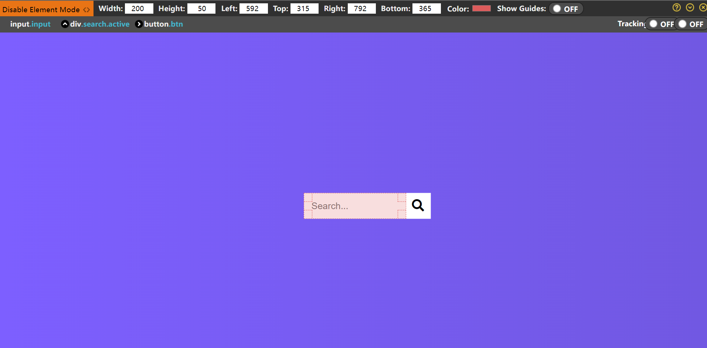

# Hidden Search Widget

上下文: 家, 电脑
下一次执行日期: February 14, 2022
优先级: ❗❗❗❗❗
已完成: Yes
执行日期: 2022/02/14
频率: 一次性

------

为了更好的测量准确的px，试图找找有没有好用的截图工具有这方面功能的。

- 两款Google插件
  
    [Page Ruler Redux](https://chrome.google.com/webstore/detail/page-ruler-redux/giejhjebcalaheckengmchjekofhhmal/related?hl=zh-CN)
    
    [Better Ruler](https://chrome.google.com/webstore/detail/better-ruler/ilcnadaaninblgbekoaihdhoiecaflie/related?hl=zh-CN)
    
- 马克鳗标注软件
  
    [马克鳗](http://www.getmarkman.com/#/download-modal)
    

使用Page Ruler Redux插件的组件模式可以准确测量，并且还能看到是如何布局的，真是太棒了。




## 问题集

1. 两个是一样的宽高，为什么input比较大？
   
    
    
    因为input存在padding和border默认属性没有清零。
    
1. body高度100vh为什么会出现滚动条？
   
    因为body也是有margin: 8px; 的默认属性没有清除。
    
2. ~~搜索框内文字的左边距实现~~
   
    应该使用第5点的`text-indent`属性👇
    
    
    
    ```html
    // 在文本前添加空格即可
    <input placeholder="   Search..." type="text">
    ```
    
3. 为什么会有这种样式？是focus的默认样式吗？
   
    
    
    原来是outline外边框没有去除。
    
4. 光标的位置如何改变？
   
    
    
    [text-indent](https://developer.mozilla.org/zh-CN/docs/Web/CSS/text-indent) 使一个块元素首行文本内容缩颈相应长度。
    
5. 存在input自动获取聚焦HTML属性⇒ `autofocus`
   
    解决获取聚焦的问题。


## 知识点

1. CSS [linear-gradient()](https://developer.mozilla.org/zh-CN/docs/Web/CSS/gradient/linear-gradient()) 函数用于创建一个可以多种颜色渐变的图片。
   
    ```css
    // 表示背景图片是是渐变轴90°(to right)，从*色渐变到#色
    background-image: linear-gradient(90deg, #7d5fff, #7158e2);
    ```
    
2. [text-indent](https://developer.mozilla.org/zh-CN/docs/Web/CSS/text-indent) 使一个块元素首行文本内容缩颈相应长度。

3. 存在input自动获取聚焦HTML属性⇒ `autofocus`


## 最后实现效果


## demo总结

- 命名不规范
- 能用icon替代的没用


- 作者的CSS部分使用的是**绝对定位+translateX移动**，我觉得没必要就没细看了。我觉得我的比较简单一些。