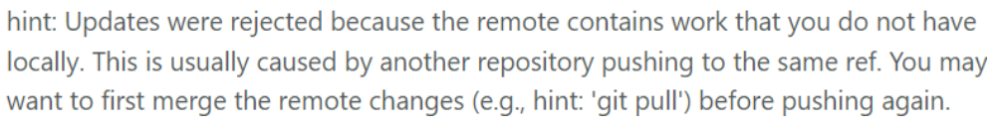
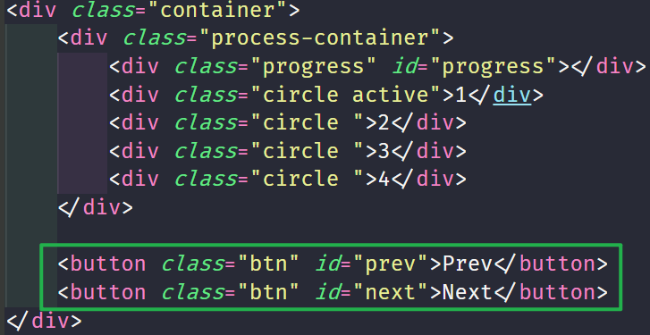
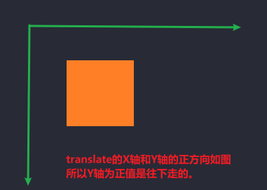

# Progress Steps  


---
> 这是50 Projects in 50 Days -HTML/CSS and JavaScript 的第二个小demo练习

## 遇到的问题  

**1. git推送错误**

   在本地创建了第二个项目的文件夹之后，想要推送到github上，而出现如下错误：  

  

   问题原因：当前本地仓库提交的代码结构与GitHub上的代码结构不同。产生了冲突。

   解决方式:

   ```javascript

   git pull // 用于将远程获取的代码合并到本地的版本
   git push origin master
   ```  

   [git pull参考](https://www.runoob.com/git/git-pull.html)  
   [git push参考](https://www.runoob.com/git/git-push.html)  

   **origin**: 就是一个名字，它是在你clone一个托管在Github上代码库时，git为你默认创建的指向这个远程代码库的标签,通常情况下代指你远程的那个仓库。

<br>
<br>

**2. 在没有容器包围的两个按钮如何居中？** 

  

```css
text-align: center;
```

**3. 想要干净button按钮，需要清楚默认设定**
```css
border: none;
outline: none;
```
<br>
<br>

[**4. 边框border外层有轮廓outline**](https://www.runoob.com/css/css-outline.html)

<br>
<br>

**5. 关于几个用到的伪类**  

`:active`  

`:root` 这个 CSS 伪类匹配文档树的根元素。对于 HTML 来说，:root 表示 <html> 元素，除了优先级更高之外，与 html 选择器相同。通常用来声明[全局变量](#9.全局变量)。
```css
:root {
  --line-border-fill: #3498db;
  --line-border-empty: #e0e0e0;
}
```
  
<br>
<br>

[**6.关于属性transition**](https://www.cnblogs.com/xiaohuochai/p/5347930.html)  


<br>
<br>

[**7.如何理解伪类和伪元素?**](https://developer.mozilla.org/zh-CN/docs/Learn/CSS/Building_blocks/Selectors/Pseudo-classes_and_pseudo-elements)  

值得注意的是：
   伪元素before和after通常情况下是不插入文本内容的，这是因为对于屏幕阅读器来说是不可见的。 一般情况下用来插入符号比如箭头等，也是希望屏幕阅读器不要读出它们。还有一种常见的情况是，插入空字符串''，并设定`display: block`,就可以对其进行样式化，进而改变其行为和状态。

<br>
<br>

**8. 关于transform属性**  

transform属性允许你 **移动、旋转、缩放、偏斜** 元素。其中translate表示移动。  

  

`translate(x,y)`是x，y轴的属性一起写。

`translateY(<translation-value>)`:表示在Y轴上平移多少长度(可以是数值/百分比)。  

`translate(-50%,-50%)`:  
1. 在x轴上向左平移当前选择器指向的本元素宽度的50%。
2. 在y轴上向上平移当前选择器指向的本元素高度的50%。
所以通常被用来居中容器：
```css
position: absolute;
top: 50%;
left: 50%;
transform: translate(-50%,-50%);
```
<br>
<br>

#### 9.全局变量
>通常用来统一页面的风格和样式。也称之为自定义属性。  

全局变量一般定义在根伪类`:root`下，以便在HTML文档的任何地方都可以访问到它。

**声明全局变量**: 在变量名称之前加上两个中横线`--`。


    :root {
      --Color: #ccc;
      --BackGround: #fff;
    }

:warning:值得注意的是：全局变量的声明对 *大小写敏感*  

**声明局部变量**：顾名思义，就是在指定的选择器容器范围内有效。  

**var( )函数**：用来读取变量

[掘金参考](https://www.cnblogs.com/WQLong/p/7792174.html)  
[MDN参考](https://developer.mozilla.org/zh-CN/docs/Web/CSS/Using_CSS_custom_properties)
<br>
<br>

### forEach的用法
>也用于遍历数组，但可为可迭代的列表中的每个元素调用一个函数

    circles.forEach((circle, idx) = {
      // code...
    })
- circle 是当前数组circles的值，是必须参数。
- idx    是index的缩写，当前元素的索引号，可选参数。
- Array  是当前元素所属的数组的对象，可选参数。

