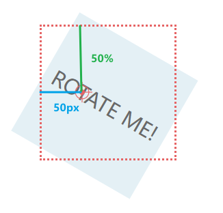

# Rotating Navigation Animation

Category: CSS, Github, HTML, demo
tag: 笔记

## **问题**

1.  为什么html和body的背景色设置成不同的颜色了，但是全部被html的背景色覆盖了？
    
    html就是跟元素，在未设定浏览器的背景色时，如果设置了body的颜色，则body的背景色被设定为浏览器的颜色。
    
    如果设定了html的背景色，则浏览器的背景色会被重新设定。所以全部被html的背景色覆盖掉。
    
2. transform的rotate属性怎么用？
   
    rotate属性可以使元素旋转，默认旋转原点是元素的中心。通常结合transform-origin改变原点的位置之后再旋转。
    
3. 使用什么代码取到html这个元素？

```jsx
let html = document.documentElement;
```

1. 如果禁止x轴方向上的滚动条，以确保x轴上内容溢出后隐藏？

```css
overflow-x: hidden;
```

1. 如何使页面旋转一定的角度?

```css
transform-origin: top left;  // 更改一个元素变形的原点为左上角

transform: rotate(-20deg);  // 逆时针旋转20°

transition: transform 0*.5s* linear;  // 旋转的动画过渡持续0*.5s*
```

### 关于`transform-origin`属性

> 更改元素的原点位置。
> 

`transform-origin: 50% 50% 0;` 是初始值，相当于center，表示原点在中心位置。

- 第一个值：X轴的偏移量，是以元素本身的宽高相对计算。设width：100px; 则50%=50px。
- 第二个值：Y轴的偏移量，同上。
- 第三个值：Z轴的偏移量。

    可以只使用一个值或者两个值，又或者同时三个一起使用。

⚠️但是少于三个值时，缺少的值则为原来的初始值。

`transform-origin: 50px; == transform: 50px 50% 0;`



**参考链接：**

- [transform-origin](https://cssreference.io/property/transform-origin/)
- [MDN](https://developer.mozilla.org/zh-CN/docs/Web/CSS/transform-origin)

### 关于`rotate()` 函数

> 可以定义一种将一个元素围绕一个定点（默认是元素中心，也可以由`transform-origin`属性指定的原点）旋转而不变形的转换。
> 

函数值是旋转的角度degress，例如：

```css
transform: rotate(-90deg);
```

**参考链接：**[https://developer.mozilla.org/zh-CN/docs/Web/CSS/transform-function/rotate()](https://developer.mozilla.org/zh-CN/docs/Web/CSS/transform-function/rotate())

### 深入了解`position`定位属性

> 指定一个元素在文档中的定位方式
> 

四种定位方式：

1. **static 无定位**
   
    默认值，表示按正常的文档流显示该元素，没有做任何定位处理。并且该状态下，top, right, left, bottom 和z-index属性无效。
    
2. **relative 相对定位**
   
    使用此定位方式的元素会占据其static时的位置空间，即不会改变当前的页面布局。该状态下，top, left等值是相对于原static位置计算的：
    
    ```css
    position: relative;
    top: 20px;
    left: 40px
    ```
    
    
    
    相对定位会使元素提升一个层级。
    
    设置相对定位后，而不设置偏移量，元素不会发生任何变化。
    
3. **absolute 绝对定位**
   
    使使用此定位方式的元素跳出文档流，即原来占据的位置空间会消失，页面布局会改变。该状态下，top，left的值是**要寻找最近的非static定位的祖先元素计算偏移量**。并且绝对定位的元素可以设置margin值，且不会和其他元素的边距合并。
    
    如图，第二个黄色方块向上找不到最近的非static定位的祖先，则会相对于根html来计算偏移量。
    
    ```css
    position: absolute; 
    top: 50%;
    left: 50%;
    ```
    
    
    
    ❓疑问：如果父元素或者是祖先是absolute定位，则该如何计算偏移量？
    
    
    
    同样是最近的非static定位的祖先，这里就是灰色块的position: absolute;
    
    1. **fixed 固定定位**
       
        元素被移除正常文档流，不占据位置空间。根据屏幕窗口来计算相对的偏移量。元素的位置在屏幕滚动时不会改变。
        
        将灰色块position: fixed; 则其包含的黄色块是绝对定位的话，是根据灰色块计算位置，并且随着屏幕滚动是跟随fixed的灰色块的。
        
    2. sticky 粘性定位
       
        正常情况下，保持正常的文档流。当页面滚动你所设定的值时时，会定在那个位置。
        
        ```css
        position: sticky;
        top: -2px;
        ```
        
        
        
    
    demo文件：
    
    [positionDemo.html](note-images/positionDemo.html)
    

### 关于透明与不透明

### **[opacity](https://developer.mozilla.org/zh-CN/docs/Web/CSS/opacity)**

> 不透明属性，数值0-1；越接近0越透明⇒看不见。
> 

```css
opacity: 0.5;
```

⚠️该属性会导致文字也会跟着变成透明，因为当该属性应用于某个元素上时，就会把这个元素（包括它的内容）当成一个整体看待。

### [Transparent](http://www.santii.com/article/209.html)

在css3中，可以作为任何一个有color属性的值，表示颜色完全透明。

### [RGBA表示透明度](https://www.w3schools.com/css/css_image_transparency.asp)

可以解决opacity使元素（包括内容和文字）全透明的弊端，使用`rgba(76, 175, 80, 0.3)`  表示含有0.3不透明度的绿色背景。

RGBA 颜色值通过以下方式指定：rgba(red, green, blue, *alpha* )。*阿尔法*_ 范围是介于 0.0（完全透明）和 1.0（完全透明）之间的数字不透明）。

### 回位translateX(0)效果演示


从偏移X轴-150%延迟0.3s后过渡到0，相当于回位。

### **查询资料汇总**

- [css优先级计算规则-css样式覆盖问题](https://www.cnblogs.com/wangmeijian/p/4207433.html)
- [**css选择器MDN**](https://developer.mozilla.org/zh-CN/docs/Web/CSS/CSS_Selectors)
- [z-index属性](https://developer.mozilla.org/zh-CN/docs/Web/CSS/z-index)
- [text-transform属性](https://developer.mozilla.org/zh-CN/docs/Web/CSS/text-transform)
- [text-decoration属性](https://developer.mozilla.org/zh-CN/docs/Web/CSS/text-decoration)

